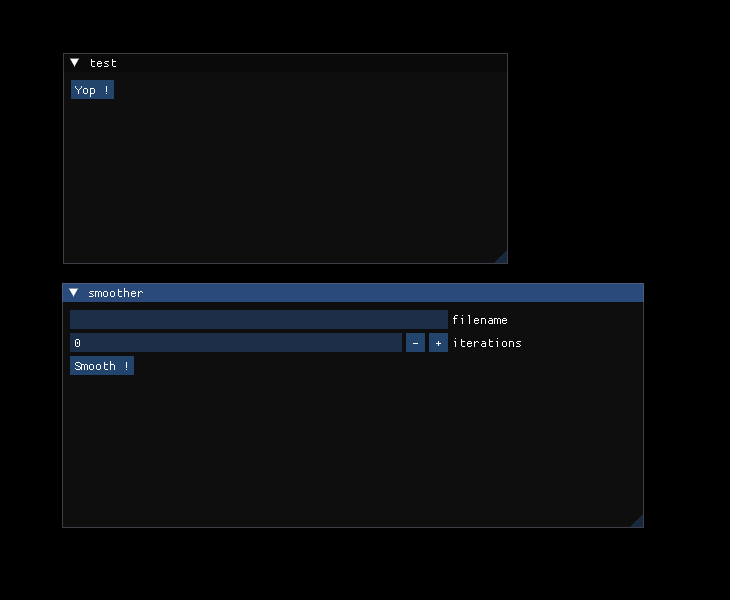

# python-plugin-system

Test of a system enabling python scripts to be loaded as application plug-ins.

This test shows how to make the python plugin communicate with the application in both directions. The python plugin defines anchor functions that can be called by the application. While the application exposes the functions that the plugin can call.

It also shows how to call an ultimaille C++ program from the python plugin.

Below, an example of an application that loads two python plugins, named `test` and `smoother`:

 - `test` shows a minimal example that display `Hello!` on button click
 - `smoother` use ultimaille to smooth a 3D model surface
 
 For more details about plugins, go to:

  - [test plugin](plugins/test/test.py)
  - [smoother plugin](plugins/smoother/smoother.py)